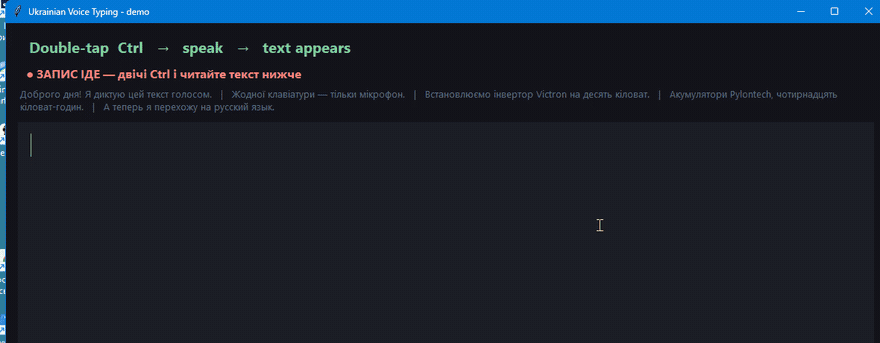

# Offline Voice Typing for Windows

**Multilingual voice typing that runs entirely on your PC.** Press a key,
talk, and the text lands in whatever field has focus — browser, Word, Excel,
Telegram, your CRM. No cloud, no subscription, no account, and no audio ever
leaves the machine.

25 languages offline, detected automatically per phrase — and ~99 more
through an optional cloud key. Runs on the CPU — no NVIDIA card needed. **0.16 s** from the end of a phrase to text on an i9 desktop;
even 2 CPU threads are faster than any cloud API measured.

Speech-to-text · dictation · voice input · offline · local · privacy ·
Ukrainian · українська · Deutsch · English · Polski · Čeština · and 20 more



**Double-tap Ctrl. Talk. The text appears.** That is the whole interaction —
no window to open, no button to click, no app to switch to.

*Unedited recording: Ukrainian speech, a Latin brand name and a number, then a
switch of language mid-session — all detected automatically.*

---

## Why this exists

Windows has built-in voice typing (`Win+H`). It covers about 36 languages
and sends your voice to Microsoft. **Ukrainian is not among them** — Russian,
Polish and Bulgarian are, Ukrainian is not, and
[the request to add it](https://learn.microsoft.com/en-us/answers/questions/5913553/add-ukrainian-language-support-for-windows-voice-t)
has no answer.

This started as a Ukrainian workaround using a cloud API
([ukrainian-voice-typing](https://github.com/alex80674097219/ukrainian-voice-typing),
now archived). Then a local model turned out to be **6× faster** than the
cloud on the same phrases — and the cloud path became the optional reserve.

## Languages

Recognition uses NVIDIA's [Parakeet TDT 0.6B v3](https://huggingface.co/nvidia/parakeet-tdt-0.6b-v3),
which covers 25 European languages with automatic detection and punctuation:

Bulgarian · Croatian · Czech · Danish · Dutch · English · Estonian · Finnish ·
French · German · Greek · Hungarian · Italian · Latvian · Lithuanian · Maltese ·
Polish · Portuguese · Romanian · Russian · Slovak · Slovenian · Spanish ·
Swedish · **Ukrainian**

You can switch language mid-sentence — dictate Ukrainian, drop in an English
brand name, answer a colleague in German. Nothing to configure.

### Beyond those 25: ~99 languages with an optional cloud key

The local model is the default and the point of the project. But the cloud
path from the original version is still inside, and with an API key it gives
you Whisper's ~99 languages — Arabic, Hebrew, Turkish, Georgian, Armenian,
Kazakh, Hindi, Bengali, Urdu, Indonesian, Vietnamese, Thai, Japanese,
Korean, Chinese, Swahili and more. Two ways to use it:

- **Everything offline, one language forced to the cloud** — keep
  `ENGINE=local`, put your language into `LANG_CYCLE`, switch with
  `Ctrl+Alt+L` when you need it. Only those phrases leave the PC.
- **Everything through the cloud** — `ENGINE=stt`. This is the old
  cloud-only mode: ~1 s per phrase, ~$0.04 per hour of speech, any of the
  ~99 languages detected automatically.

So the honest language count is: **25 offline, ~99 with a key.** Which
languages Windows' own voice typing lacks and this covers, offline or not:
Ukrainian, Greek, Hebrew, Arabic, Persian, Serbian, Bosnian, Macedonian,
Belarusian, Georgian, Armenian, Azerbaijani, Kazakh, Indonesian, Malay,
Bengali, Urdu, Catalan, Icelandic, Swahili.

## Measured: local vs cloud

Same 40 real phrases (Ukrainian, Russian, English, German; 1–11 s each),
same desktop mic, Intel i9-12900F, no GPU used.

| | Median | p95 | Worst of 40 | RAM |
|---|---|---|---|---|
| **Local, Parakeet INT8, 8 threads** | **0.16 s** | **0.34 s** | **0.48 s** | +730 MB |
| Local, 2 threads | 0.25 s | 0.62 s | 0.71 s | +730 MB |
| Cloud, `whisper-large-v3-turbo` via OpenRouter | ~1.0 s | 5.3 s | 22 s | — |

Accuracy on those phrases: parity. Local was better on Latin brand names
(`Victron Energy` instead of «Виктрон Энерджи») and a few word forms; cloud
was better on question marks and a couple of Ukrainian spellings. German with
a Slavic accent is weak on both.

What local removes entirely: the 5–22 s stalls, the per-minute cost, and the
Whisper hallucinations on silence (`*breath*`, «Дякую», «Продолжение
следует») — Parakeet was not trained on subtitles.

## How it works

1. While dictation is on, the microphone is recorded continuously.
2. Speech is cut into phrases at natural pauses — voice activity detection
   with an adaptive noise floor.
3. Each phrase is recognised on the CPU by Parakeet through
   [onnxruntime](https://onnxruntime.ai/) (via
   [onnx-asr](https://github.com/istupakov/onnx-asr)).
4. Text is pasted **strictly in the order it was spoken**.

Text appears phrase by phrase *while you keep talking*, not after you stop.
Delay after a pause is about 0.6 s: the 0.45 s pause itself plus ~0.16 s of
recognition.

## Controls

| Action | Key |
|---|---|
| Start / stop dictation | **double-tap Ctrl** |
| Same | **Num Lock**, **Scroll Lock**, **Pause** |
| Force a language (goes to the cloud reserve): auto → uk → ru → de → en | **Ctrl+Alt+L** |

Double-tapping Ctrl only counts when Ctrl is pressed and released *alone* —
`Ctrl+C` and `Ctrl+V` never trigger it. Num Lock and Scroll Lock are restored
to their previous state right after firing, so the numeric keypad and Excel
arrow keys keep working.

Audio feedback: two rising beeps = on, two falling = off, one long low =
error. A small badge in the corner shows the current state.

**A pause to think is not a full stop.** Cut a phrase at a 0.45 s pause and
the model ends it with a period — so hesitating mid-sentence used to chop your
thought in two. The phrase is sent for recognition immediately, but the
punctuation decision waits until `JOIN_WINDOW` (1.1 s). Speak again inside that
window and the period is dropped and the next word lowercased; stay silent and
the sentence really did end.

**It switches itself off.** After `IDLE_OFF` seconds of silence (2 minutes by
default) dictation stops on its own, with the badge fading out and counting
down for the last 10 seconds. A microphone left on is a liability.

**Only one copy runs.** Starting it twice would paste every phrase twice;
the second instance exits immediately.

## Install

Requires Python 3.10+ and Windows 10/11. No GPU needed.

```
git clone https://github.com/alex80674097219/offline-voice-typing
cd offline-voice-typing
python -m venv venv
venv\Scripts\python.exe -m pip install -r requirements.txt
venv\Scripts\pythonw.exe dictate.py
```

On first start the model (~700 MB) is downloaded into `models\` — once.
After that the program works with the network cable unplugged.

To start it with Windows, put a shortcut to
`venv\Scripts\pythonw.exe dictate.py` in `shell:startup`.

### Optional: cloud reserve

Without an API key the program is fully offline and that is the intended
mode. If you want a fallback for the first seconds while the model loads,
for a forced language via `Ctrl+Alt+L`, or for a language Parakeet lacks:

```
copy api_key.example.txt api_key.txt      # paste a key from openrouter.ai/keys
```

`api_key.txt` is in `.gitignore`. With a key present the cloud is used only
in those three cases; every other phrase stays on your PC.

## Configuration

Everything lives in `settings.txt` (commented, in Ukrainian). Restart after
editing.

| Setting | What it does |
|---|---|
| `ENGINE` | `local` (default) · `stt` cloud · `chat` |
| `LOCAL_THREADS` | CPU threads for recognition — see "8 beats 14" below |
| `SILENCE_TAIL` | Pause length that ends a phrase |
| `JOIN_WINDOW` | Below this, a pause is a hesitation, not a full stop |
| `IDLE_OFF`, `IDLE_WARN` | Switch off after silence, and the warning before it |
| `MIN_PEAK`, `PEAK_SNR`, `MIN_VOICED` | Noise gate, relative to the measured room noise |
| `HOTKEY`, `DOUBLE_TAP` | Keys |

`replacements.txt` is a plain word list applied to the recognised text
locally. Recognition models are unstable on proper nouns and on *your*
pronunciation of them — the same brand comes back in Latin one day and
transliterated the next. One line per term fixes it:

```
віктрон = Victron
пайлонтех = Pylontech
кастар = Kstar
мппт = MPPT
```

## What this cost me to learn

Measurements below are from real dictation on one setup — a USB desktop mic,
Ukrainian and Russian speech with solar-industry terms. Your numbers will
differ, but the *shape* of the problems generalises.

### Local is faster than the cloud — with the right model

First attempt at local recognition was `faster-whisper` on the same CPU:
`large-v3-turbo` took **8.5 s** per phrase, `small` took 2.0 s and mixed
languages inside one sentence. I concluded local was hopeless without an
NVIDIA card and went back to the cloud.

Parakeet TDT is a different architecture (a transducer, not an
encoder-decoder that generates token by token) and its ONNX INT8 build does
the same phrase in **0.16 s**. The lesson is not "local is fast" — it is
"measure the specific model on your own recordings before deciding anything".

### 8 threads beat 14

The i9-12900F has 8 performance cores and 8 efficiency cores. Giving
onnxruntime 14 threads — the "physical cores minus 2" rule — made recognition
**twice as slow** as 8 threads (0.34 s vs 0.16 s): work spills onto the slow
cores and the model waits for the slowest one. On a hybrid CPU, use the
P-core count.

### A fixed noise gate silently eats words

The gate that rejects silence was an absolute amplitude (`0.030`), tuned when
the mic peaked at 0.10–0.18. One day Windows reset the mic input level to
53 % and the voice peaked at 0.036. Half of every sentence fell below the gate
and vanished — no error, no log line that said why, just missing words. The
room noise at the time was 0.0002, so those "too quiet" segments were 100×
louder than silence.

The gate is now relative: a phrase must peak at `PEAK_SNR` (8×) above the
measured noise floor. And when the voice runs quiet for three phrases in a
row, the badge says so instead of guessing.

### The clipboard is a shared resource

Text is pasted through the clipboard. While another program holds it — a
screenshot tool, Telegram, a browser — `OpenClipboard` fails and, in the
first version, the phrase was lost. Five in a row, once. Now paste retries
for 0.4 s and, if it still fails, the recognised text is written to the log
rather than discarded.

### Chat models invent text. Use a real ASR model.

The very first version sent audio to a chat model (Gemini) with a prompt
asking it to transcribe. It produced an entire fluent English monologue that
was never spoken — assembled from vocabulary hints in my own prompt. A chat
model answers; it does not transcribe.

### Whisper says "thank you" to silence

On silence, breath or a mouse click, Whisper-family models return the most
common phrase in their training data — «Дякую», «Спасибо», "Thank you",
`*breath*`, «Продолжение следует». Measured: real speech peaked at
0.10–0.18, the hallucinations at 0.009–0.05. Three defences are still in the
code for the cloud path; the local model simply does not do this.

### Reusing one HTTPS connection cut cloud latency by more than half

Kept for the cloud reserve: a new TLS connection per phrase cost 0.8 s
*before any audio moved*. One reused `requests.Session`: 1.34 s → 0.55 s
median. It beat every model swap and provider change combined — until the
local model made the whole question moot.

## Privacy

With `ENGINE=local` (default) and no API key, **nothing leaves your
computer**. No telemetry, no account, no network access after the one-time
model download.

If you add an API key, audio goes to OpenRouter only for the three reserve
cases listed under *Install*, and the log marks every phrase `local=` or
`cloud=` so you can see which path it took.

Recognised phrases are kept locally in `phrases/` (last 40) so you can
compare models on your own voice — delete that folder or the `archive()`
call if you do not want it. Your clipboard is used to paste text and is
restored immediately afterwards.

## A note on antivirus

This program registers a global keyboard hook, reads the clipboard and records
the microphone. That is, technically, the exact signature of a keylogger.
Windows Defender or your antivirus may flag it. The source is one Python file
— read it before trusting it, which is the honest answer for any tool that
can do these things.

## Limitations

- Not word-by-word streaming. Phrases arrive after a pause, ~0.6 s behind.
  At this latency streaming would gain ~0.15 s for a lot of complexity.
- Won't see the hotkey while an elevated (admin) window has focus. Windows
  restriction; run it elevated too if you need that.
- Parakeet drops some question marks and prefers a few older Ukrainian
  spellings («проектів» over «проєктів»). Numbers are written as words.
- German with a heavy Slavic accent is poor on every model tested — force
  `de` with `Ctrl+Alt+L` and let the cloud have a go, or speak slower.
- Brand names follow *your* pronunciation. `replacements.txt` exists for a
  reason.

## Credits

- [NVIDIA Parakeet TDT 0.6B v3](https://huggingface.co/nvidia/parakeet-tdt-0.6b-v3) — the model (CC-BY-4.0)
- [istupakov/onnx-asr](https://github.com/istupakov/onnx-asr) — ONNX export and runtime wrapper
- [onnxruntime](https://onnxruntime.ai/), [keyboard](https://github.com/boppreh/keyboard), [sounddevice](https://python-sounddevice.readthedocs.io/)

## License

MIT — see [LICENSE](LICENSE).

---

## Українською

### Офлайн голосовий ввід для Windows

Натискаєш двічі **Ctrl**, говориш — і текст з'являється там, де стоїть
курсор. У браузері, у Word, в Excel, у Telegram, у CRM. Розпізнавання
працює **на твоєму комп'ютері**: без хмари, без підписки, без акаунта.
Звук нікуди не відправляється.

25 мов офлайн, визначаються автоматично для кожної фрази — українська,
російська, англійська, німецька, польська, чеська та інші. Потрібен лише
процесор, відеокарта NVIDIA не потрібна.

**Ще ~99 мов — з необов'язковим ключем API.** Хмарний шлях з першої версії
нікуди не зник: з ключем OpenRouter доступні мови Whisper — арабська,
іврит, турецька, грузинська, вірменська, казахська, гінді, японська,
корейська, китайська та інші. Або одна мова через `Ctrl+Alt+L` при
повністю офлайновому режимі, або все через хмару з `ENGINE=stt`
(~1 с на фразу, ~4 центи за годину). Чесний підсумок: **25 мов офлайн,
~99 з ключем.**

### Чому воно з'явилося

Вбудований голосовий ввід Windows (`Win+H`) **не має української мови**.
Російська є, польська є, болгарська є. Української немає, і запит до
Microsoft лишається без відповіді.

Спершу це був обхідний шлях через хмарний API
([ukrainian-voice-typing](https://github.com/alex80674097219/ukrainian-voice-typing),
тепер в архіві). Потім виявилося, що локальна модель на тих самих фразах
**у 6 разів швидша** за хмару — і хмара стала необов'язковим резервом.

### Заміри: локально проти хмари

Ті самі 40 реальних фраз, той самий мікрофон, Intel i9-12900F, без GPU:

| | Медіана | p95 | Найгірша з 40 |
|---|---|---|---|
| **Локально, Parakeet INT8, 8 потоків** | **0.16 с** | **0.34 с** | **0.48 с** |
| Локально, 2 потоки | 0.25 с | 0.62 с | 0.71 с |
| Хмара, `whisper-large-v3-turbo` | ~1.0 с | 5.3 с | 22 с |

Якість — паритет. Локально краще з латинськими брендами (`Victron Energy`
замість «Виктрон Энерджи»), хмара краще зі знаками питання й кількома
українськими написаннями. Німецька з нашим акцентом слабка в обох.

Що зникає повністю: зависання на 5–22 с, оплата за хвилини і
галюцинації Whisper на тиші («Дякую», `*breath*`, «Продолжение следует»).

### Як користуватися

| Дія | Клавіша |
|---|---|
| Увімкнути / вимкнути диктування | **подвійний Ctrl** |
| Те саме | **Num Lock**, **Scroll Lock**, **Pause** |
| Примусова мова (йде у хмарний резерв): авто → uk → ru → de → en | **Ctrl+Alt+L** |

Подвійний Ctrl рахується лише тоді, коли Ctrl натиснули й відпустили
**окремо**, тому `Ctrl+C` і `Ctrl+V` диктування не вмикають. Num Lock і
Scroll Lock одразу повертаються у попередній стан.

**Пауза на подумати — це не крапка.** Фраза йде на розпізнавання одразу,
але рішення про крапку чекає до 1.1 секунди. Заговорив далі — крапка
зникає, наступне слово стає з малої літери.

**Вимикається саме** після 2 хвилин тиші, з відліком на плашці.

**Словник термінів.** Моделі пишуть бренди так, як ти їх вимовляєш:
«Викторон», «Кастар», «Пайлонтеч». Файл `replacements.txt` виправляє це
локально, миттєво. Один рядок на термін.

### Встановлення

Потрібен Python 3.10 або новіший, Windows 10/11.

```
git clone https://github.com/alex80674097219/offline-voice-typing
cd offline-voice-typing
python -m venv venv
venv\Scripts\python.exe -m pip install -r requirements.txt
venv\Scripts\pythonw.exe dictate.py
```

При першому запуску модель (~700 МБ) завантажується в теку `models\` —
один раз. Далі програма працює й без інтернету.

Щоб стартувало разом із Windows, поклади ярлик на
`venv\Scripts\pythonw.exe dictate.py` в теку `shell:startup`.

**Хмарний резерв — за бажанням.** Без ключа програма повністю офлайн, і
це основний режим. Якщо покласти ключ з [openrouter.ai/keys](https://openrouter.ai/keys)
в `api_key.txt`, хмара підхопить лише три випадки: перші секунди, поки
модель вантажиться; примусову мову через `Ctrl+Alt+L`; мову, якої в
Parakeet немає. Решта фраз лишається на комп'ютері, і в `dictate.log`
кожна позначена `local=` або `cloud=`.

### Чесно про важливе

**Приватність.** У режимі за замовчуванням і без ключа нічого нікуди не
йде. Останні 40 фраз зберігаються локально в теці `phrases/` — щоб можна
було порівнювати моделі на власному голосі. Теку можна просто видалити.

**Антивірус.** Програма ставить глобальний перехоплювач клавіатури, читає
буфер обміну й пише з мікрофона. Технічно це сигнатура клавіатурного
шпигуна, і Windows Defender може її позначити. Тут один файл на Python —
прочитай перед тим, як довіряти.

**Чого воно не вміє.** Не пише слово за словом під час мовлення — фрази
з'являються після паузи, приблизно через 0.6 с. Не побачить гарячу клавішу,
поки активне вікно від адміністратора. Числа пише словами. Німецьку з
нашим акцентом розпізнає погано — для неї є `Ctrl+Alt+L`.

**Рівень мікрофона.** Якщо слова зникають — глянь у `dictate.log`: при
кожному вимкненні там рядок `session:` з медіаною гучності голосу. Нижче
0.03 — Windows скинув рівень входу мікрофона, підніми його в налаштуваннях
звуку.
